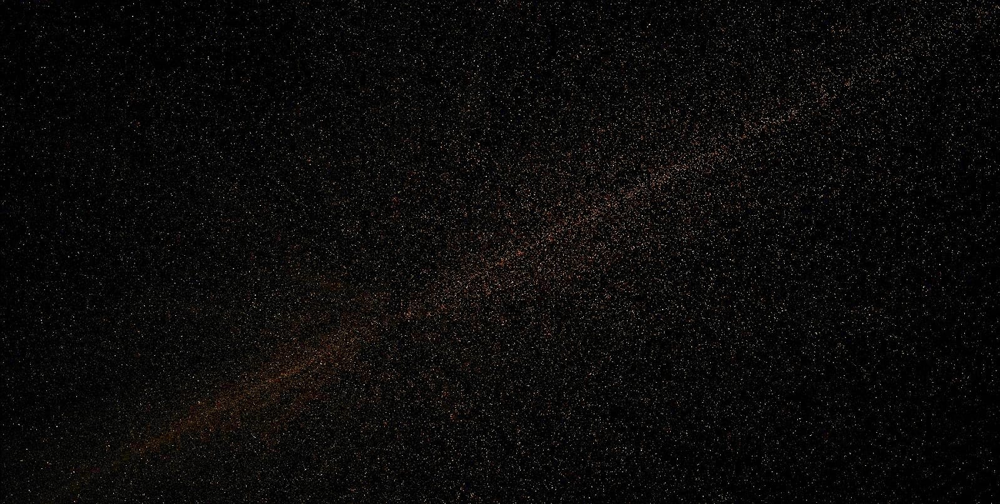

# Gaia Universe Model



Documentation at https://mrsinho.github.io/docs/Gaia_Universe_Model/index.html

# To do:
* batch rendering, subdivide space in regions
* more advanced shaders for rendering stars

Setup
* [Clone and build](#clone-and-build)
* [Download Universe Model Data](#download-universe-model-data)

Tutorial
* [Use CMake](#use-cmake)
* [Example](#example)

---

# Setup

## Clone and Build

Open the terminal and run the following commands:
```bash
git clone --recursive https://github.com/MrSinho/gaia-universe-model.git
cd gaia-universe-model/external/shengine
python export-simulation.py gaia-universe-model SHARED ../../gaia-universe-model
cd build
cmake --build .
```

## Download Universe Model Data

Inside the cloned repository directory download the GEDR3 binaries by executing one of the scripts shown below: 
```bash
cd scripts
python download-resources.py 0 25
```

# Tutorial

## Use CMake

| CMake target                                           | type       |
|--------------------------------------------------------|------------|
| [shvulkan](../ShVulkan/index.md)                       | library    |
| [shengine](../ShEngine/index.md)                       | library    |
| [gaia-archive-tools](../Gaia_Archive_Tools/index.md)   | library    |
| [gaia-universe-model](../Gaia_Universe_Model/index.md) | library    |
| gaia-universe-model-simulation                         | executable |

`gaia-universe-model-simulation` is a real time simulation, thus it needs all the libraries written on the table above.

```
