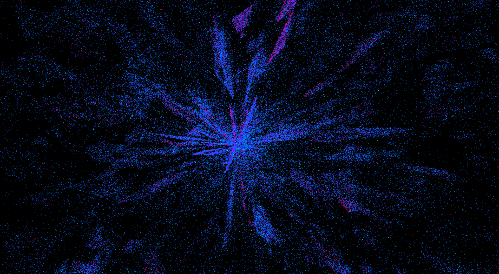

# Sidera

A 3d representation of the Gaia (Early) Data Release 3 Universe Model data uploaded by the European Space Agency (see [Gaia mission](https://www.esa.int/Science_Exploration/Space_Science/Gaia)).

[TOC]

## Build status

@note _This is a pre-release version, first release is expected to be available by the end of **August 2024**._

Programs and libraries are frequently being tested on Windows 11 and Linux Mint (WSL and physical machine) with different compilers (MSVC, gcc), and hardware configurations (RX580 4GB GDDR5, Radeon V Carrizo 500MB).

## Features

 * 3d plot customization using `.smd` files, see [`settings.smd`](https://github.com/mrsinho/sidera/blob/main/sidera/smd/settings.smd).
 * After downloading Gaia Universe Model data, load as many celestial bodies as you need in the scene, see [`settings.smd`](https://github.com/mrsinho/sidera/blob/main/sidera/smd/settings.smd).
 * Decide what parameters to read (`xyz` parameter types + color_filter). To find what parameters are compatible, see [`settings.smd`](https://github.com/mrsinho/sidera/blob/main/sidera/smd/settings.smd).
 * Graphics settings options: view modes (cartesian, polar), shade types (pixel, circle, cloud, animated cloud), see [`settings.smd`](https://github.com/mrsinho/sidera/blob/main/sidera/smd/settings.smd). 
 * Easily add new graphics features using the [`Vulkan API`](https://www.vulkan.org/) through [`shvulkan`](https://github.com/mrsinho/shvulkan)

 

## Gaia Data License

> The Gaia data are open and free to use, provided credit is given to 'ESA/Gaia/DPAC'. In general, access to, and use of, ESA's Gaia Archive (hereafter called 'the website') constitutes acceptance of the following general terms and conditions. Neither ESA nor any other party involved in creating, producing, or delivering the website shall be liable for any direct, incidental, consequential, indirect, or punitive damages arising out of user access to, or use of, the website. The website does not guarantee the accuracy of information provided by external sources and accepts no responsibility or liability for any consequences arising from the use of such data.

## Gaia Early Data Release 3 credits

> This work has made use of data from the European Space Agency (ESA) mission Gaia ([https://www.cosmos.esa.int/gaia](https://www.cosmos.esa.int/gaia)), processed by the Gaia Data Processing and Analysis Consortium (DPAC, [https://www.cosmos.esa.int/web/gaia/dpac/consortium](https://www.cosmos.esa.int/web/gaia/dpac/consortium)). Funding for the DPAC has been provided by national institutions, in particular the institutions participating in the Gaia Multilateral Agreement.

## Sidera License

Sidera relies on the Gnu General Public License v3 (GPL3), see [_github.com/mrsinho/sidera/blob/main/LICENSE_](https://github.com/mrsinho/sidera/blob/main/LICENSE) for detailed information.

## Roadmap

### Documentation, references and website
 * Write header documentation
 * Summarize the theory behind each supported parameter (new page)
 * Add commands to documentation
 * Add image or gif to github project
 * Write and link documentation for gaia-archive-tools
 * Add a gallery page

### Graphics improvements
 * Lens flares, bloom effect
 * Brightness, contrast, hue, saturation, HDR (maybe on shengine and not on sidera directly)

### User interface
 * GUI hint to edit ../../smd/settings.smd
 * Add profiling info to gui
 * Add black background regions to gui
 * Customize UI text color and UI regions color
 * Custom precision cursor
 * UI text and regions in 3d, custom function shGuiTextInSpace (update shgui)

### Serialization/parsing
 * Save or load operation inverts camera rotation
 * Edit stars brightness and more graphics parameters instead of locking them into the shader

### Missing features
 * Screenshots (need to work on shengine)
 * Time simulation based on radial velocity
 * Display vector of radial velocity
 * Create multi-dimensional graphs (x, y, z, w, v, u...)
 * Motion simulation based on gravity (experimental, embed shphysics to shengine)
 * For cartesian graph use orthographic projection instead of perspective
 * Option for panorama mode and different panorama projections
 * Add orthosphere and planetarium mode
 * Display galactic center and probe location
 * Display polar and cartesian grid and text on grid (see gaiasky)
 * Display constellation and constellation boundaries
 * Option for galactic, elliptic, equatorial and recursive grid
 * Option for distance fade effect
 * Option for star pixel size
 * Discard pixels with z buffer higher than +1 (vulkan range is 0:1)
 * Discard pixels with distance from camera higher than a certain value defined with smd file

### Datasets
 * Dataset manager app like in gaiasky (flutter could be a possible API)
 * Find interstellar matter / nebulae datasets

### Releases
 * Shci tests before August 2024 release
 * New and modern shinstaller (dismiss python application in favour of dart probably)
 * GDR3 update (first add/improve all the previous features)
 
## Documentation and reference pages

 * Sidera related pages, see [_mrsinho.github.io_](https://mrsinho.github.io/sidera-docs/pages) for further documentation about the Sidera application.
 * ESA Gaia landing page, [_esa.int_](https://www.esa.int/Science_Exploration/Space_Science/Gaia).
 * ESA Cosmos, [_cosmos.esa.int_](https://www.cosmos.esa.int/web/gaia-users/archive/gedr3-documentation/), includes a rich [_overview page_](https://www.cosmos.esa.int/web/gaia/early-data-release-3) (with access to the download page of the data release, query documentation and other services), [_online documentation_](https://gea.esac.esa.int/archive/documentation/GEDR3/index.html) (hardware, data processing), [_pdf documentation_](https://gea.esac.esa.int/archive/documentation/GEDR3/pdf/GaiaEDR3_documentation_1.1.pdf), [_RGB filters passband information and notes_](https://www.cosmos.esa.int/web/gaia/edr3-passbands/), [_known issues_](https://www.cosmos.esa.int/web/gaia/edr3-known-issues/), [_related papers about GEDR3_](https://www.cosmos.esa.int/web/gaia/edr3-papers/).
 * Gaia@AIP services (Leibniz-Institute for Astrophysics Potsdam), [_gaia.aip.de_](https://gaia.aip.de): includes [_Gaia data license and data release credits_](https://gaia.aip.de/cms/credit/), [_Gaia data release/catalogues documentation_](https://gaia.aip.de/cms/data/catalogues/) (includes GEDR3 [_data tables_](https://gaia.aip.de/metadata/gaiaedr3/), such as [_gaiaedr3.gaia_universe_model_](https://gaia.aip.de/metadata/gaiaedr3/gaia_universe_model/)).
 * CDN ESAC (Content Delivery Network, European Space Astronomy Centre), [_gea.esac.esa.int_](https://gea.esac.esa.int/archive/): data release download page.

## Dependencies

 * [`Gaia Early Data Release 3`](https://www.cosmos.esa.int/web/gaia/early-data-release-3)
 * [`gaia-resources`](https://github.com/mrsinho/gaia-resources)
 * [`shengine`](https://github.com/mrsinho/shengine)
 * [`vulkan`](https://www.vulkan.org/)
 * [`shvulkan`](https://github.com/mrsinho/shvulkan)
 * [`gaia-archive-tools`](https://github.com/mrsinho/gaia-archive-tools)
 * [`cglm`](https://github.com/recp/cglm)
 * [`glfw`](https://github.com/glfw/glfw)
 * [`smd`](https://github.com/mrsinho/smd)

## Feedback and contributing

I have been personally dedicated to this project since the beginning of 2022, investing a significant amount of my spare time developing the engine and working on new features. Should you encounter any issues with the application or wish to introduce new features while addressing existing ones, I welcome your contributions to the repository. You can contribute by either opening an issue or submitting a pull request.

---

© 2024 Anas Boustani. All rights reserved.

The above copyright notice and this permission notice shall be included in all copies or substantial portions of the Software.
All trademarks and registered trademarks appearing on this website are the property of their respective owners.